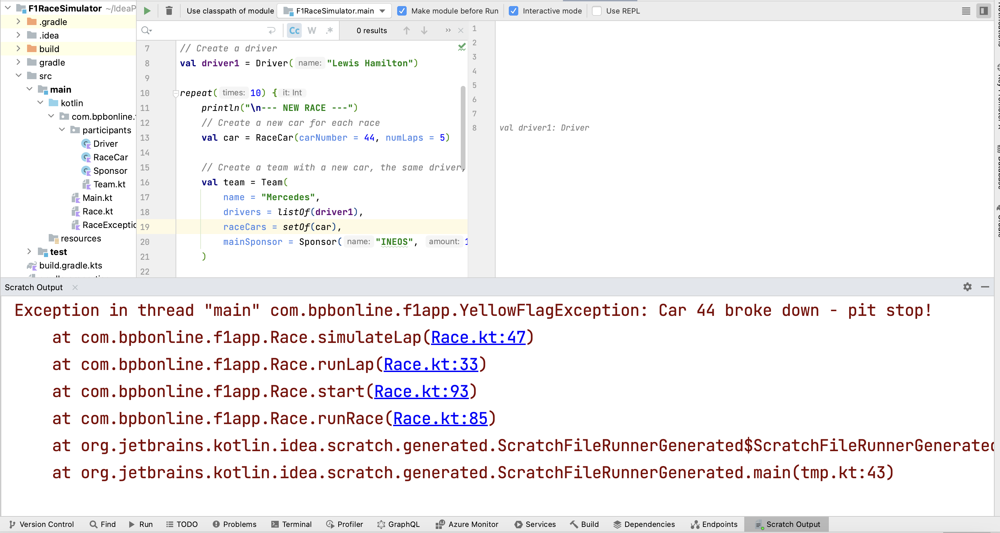

= 10. Exception Handling
:sectanchors:

As already explained earlier in this chapter, an exception is an event that arises during the execution of a program, interrupting the normal flow of the program's instructions. Kotlin provides a sophisticated mechanism to handle exceptions using `try-catch` blocks. This allows us to anticipate and manage errors that might occur during the execution of our code.

== Creating custom exceptions

We can create custom exceptions by defining a new class that inherits from the `Exception` class. This can be useful when we want to throw specific exceptions that carry more contextual information about an error.

To demonstrate this, let's create two custom exceptions for our racing simulation: `SafetyCarException` and `YellowFlagException`. Create a new `RaceException` class in the root package, e.g. `com.bpbonline.f1app`, that contains all exceptions for our application:

[source,kotlin]
----
open class RaceException(message: String) : Exception(message)
class SafetyCarException(message: String) : RaceException(message)
class YellowFlagException(message: String) : RaceException(message)
----

== Throwing exceptions

In our simulation, a breakdown or collision during a race lap can now be represented by throwing an exception. Let's update our `simulateLap` function to throw our custom exceptions when a breakdown or collision occurs:

[source,kotlin]
----
private fun simulateLap(driver: Driver, car: RaceCar): Double =
    when (generateRaceEvent()) {
        RaceEvent.BREAKDOWN -> {
            car.isPitStopNeeded = true
            throw YellowFlagException(
                "Car ${car.carNumber} broke down - pit stop!"
            )
        }
        RaceEvent.COLLISION -> {
            car.isPitStopNeeded = true
            throw SafetyCarException(
                "Car #${car.carNumber} collided - pit stop!"
            )
        }
        RaceEvent.NORMAL -> {
            car.currentLap++
            val lapTime = Random.nextDouble(1.0, 2.0)
            car.addLapTime(car.currentLap, lapTime)
            println("Driver ${driver.name} completed lap: $lapTime min")
            lapTime
        }
    }
----

== Try-catch-finally

We can handle exceptions using a `try-catch-finally` statement. The `try` block contains the code that might throw an exception. If an exception is thrown, it's caught and handled by the `catch` block. Regardless of whether an exception is thrown or not, the `finally` block always executes.

If you run our Scratch file with the previous experiment in it, there's a good chance of getting an exception. Run the Scratch file and check the Scratch Output tab typically located at the bottom of IntelliJ IDEA, as shown below:

Let’s update our scratch file to add a try-catch-finally block to handle exception:

[source,kotlin]
----
try {
    // Start and end the race
    race.runRace()
} catch (e: Exception) {
    println("Caught an exception: ${e.message}")
} finally {
    println("This finally block will always be executed.")
}
----

Run the Scratch file again. You should be able to spot occurrences of Exceptions being caught and verify that the finally block is always executed. Remember to use the **+** on the side of the Scratch file to expand the output. You can also use the search bar above the output area in the Scratch file to look for specific text:

----
--- NEW RACE ---
Starting lap 1
Driver Lewis Hamilton completed lap: 1.6735914541970052 min
Starting lap 2
Caught an exception: Car 44 broke down - pit stop!
This finally block will always be executed.
----

== Multiple catch blocks

We now need to update our F1 app to handle newly thrown exceptions. We can manage different types of exceptions in a more granular way by having multiple catch blocks in our try-catch construct. Each catch block handles a specific type of exception.

First, we'll prepare our app to handle race exceptions. Afterwards, we'll modify our 'runLap' function to effectively manage these exceptions.

. Add a constant `SLOWDOWN_TIME` in the companion object of the `Race` class. This constant represents the time it takes for all the cars to slow down in the case of a safety car deployment or a yellow flag being raised.

[source,kotlin]
----
companion object {
    // 5 minutes
    const val PITSTOP_TIME = 5.0
    // 1 minute
    const val SLOWDOWN_TIME = 1.0
}
----

. Create the `handlePitStop()` function which will be used when a car needs a pit stop. It takes a `Result` object as a parameter. Within the function, first print a message indicating that the car is in the pit stop and skipping this lap. Then reset the `isPitStopNeeded` flag of the car to `false` as the pit stop is being handled. Lastly, add the pit stop time to the `totalLapTime` of the result.

[source,kotlin]
----
private fun handlePitStop(result: Race.Result) {
    println("\"Car ${result.car.carNumber} skips this lap.")
    // reset the flag
    result.car.isPitStopNeeded = false
    // add pit stop time
    result.totalLapTime += Race.PITSTOP_TIME
}
----

. Add the `slowDownLapTimes()` function, which will be used to increase the lap times for all drivers to simulate a race slowdown. This function goes through every `Result` object in the `raceResults` list and increases its `totalLapTime` by the `SLOWDOWN_TIME`. This simulates the effect of a race slowdown where all cars are forced to slow down, therefore taking a longer time to complete the lap.

[source,kotlin]
----
private fun slowDownLapTimes() {
    // Increase lap times for all drivers to simulate a race slowdown
    raceResults.forEach { it.totalLapTime += Race.SLOWDOWN_TIME }
}
----

. Now create a `runLapForDriver` function, where we are going to handle exceptions thrown when a lap is simulated. Each type of `RaceException` is handled in its own catch block:

[source,kotlin]
----
private fun runLapForDriver(result: Race.Result) {
    try {
        val lapTime = simulateLap(result.driver, result.car)
        result.totalLapTime += lapTime
        if (lapTime < result.fastestLap) {
            result.fastestLap = lapTime
        }
    } catch (e: SafetyCarException) {
        println("${e.message} Safety car deployed.")
        slowDownLapTimes()
    } catch (e: YellowFlagException) {
        println("${e.message} Yellow flag raised.")
        slowDownLapTimes()
    }
}
----

. Finally update `runLap()` function to use the new features. The `runLap()` function now checks if a car needs a pit stop before a lap is simulated. If the car needs a pit stop, the lap is skipped, and the pit stop is handled using the `handlePitStop()` function:

[source,kotlin]
----
private fun runLap() {
    teams.forEach { team ->
        team.driverCarMap.forEach { (driver, car) ->
            val result = findOrAddResult(team, driver, car)
            // If the car needs a pit stop, we skip this lap for the driver
            if (car.isPitStopNeeded) {
                handlePitStop(result)
            } else {
                runLapForDriver(result)
            }
        }
    }
}
----

With these changes, our racing simulation can now handle pit stops, and different kinds of race interruptions using the custom exceptions. Each interruption is handled differently: a car needing a pit stop will skip its lap, and a race interruption due to a safety car or a yellow flag will slow down all cars.

Let's now execute `Main.kt` again to witness our finished app in action. Congratulations on reaching this milestone!

➡️ link:./11-kdoc-basics.adoc[11. KDoc Basics]

⬅️ link:./9-control-flow-statements.adoc[9. Control Flow Statements]
