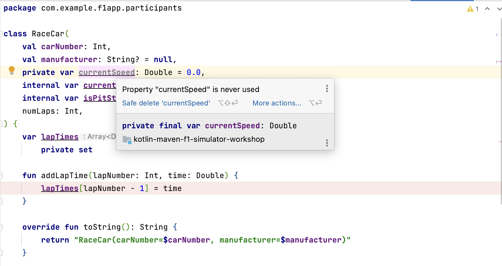
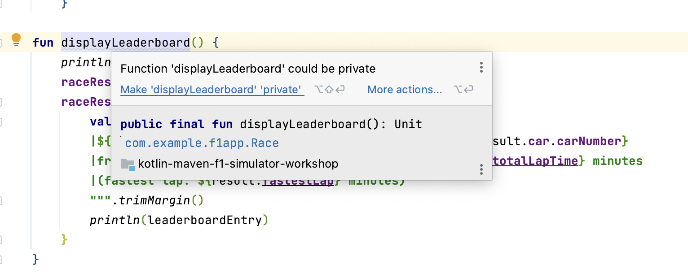
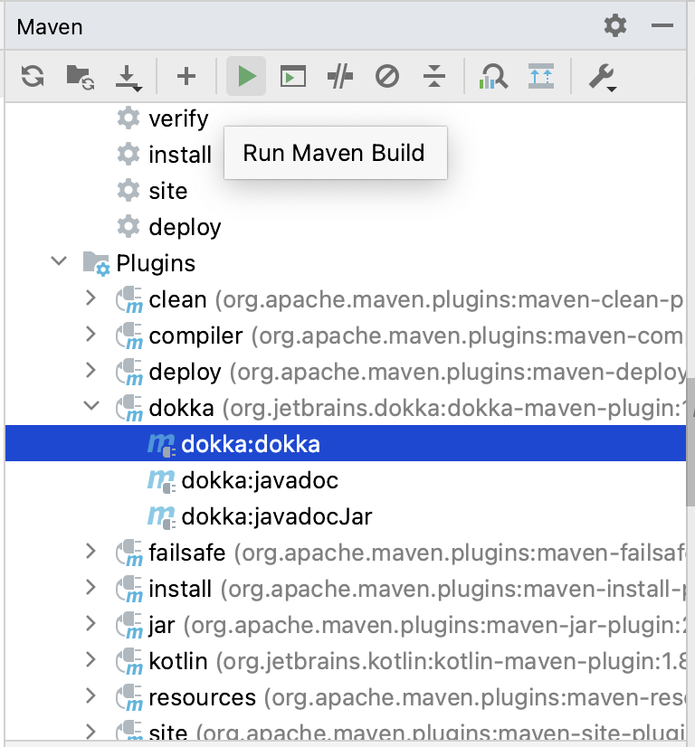
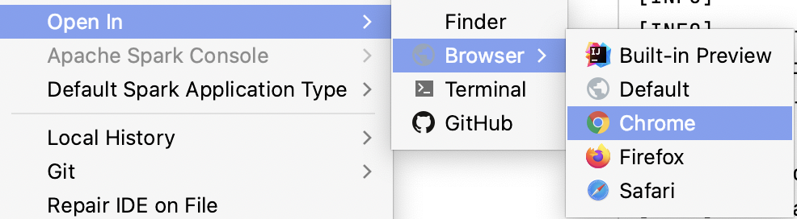

= 12. KDoc Basics
:sectanchors:

You can find KDoc syntax and documentation here: https://kotlinlang.org/docs/kotlin-doc.html#block-tags

== 12.1 Tidy code

Before we start on KDoc of our F1 app, we need to tidy the code. We have created some unused members to demonstrate language features of Kotlin, we have also left some members public in order to try them out in a Scratch file. let's now go through the code and improve it.

For example, remove unused variable:

Another example, make function private:

Here is a commit to example tidy updates:
https://github.com/elenavanengelenmaslova/kotlin-maven-f1-simulator-workshop/commit/37904f0ff0af2ceaeb9b04782551db332c98ef30

== 12.1 Add KDoc

Add KDoc to all publicly and internally visible members of every kotlin file in *main/kotlin* source folder.

TIP: Nested functions are only visible within the scope of the outer function therefore they do not need to have KDoc in this task.

TIP: Any extension functions defined within a class definition are only accessible within that class therefore they do not need to have KDoc in this task.

For example:

[source,kotlin]
----
/**
 * Represents a race car in the race.
 *
 * @property carNumber The unique number identifying the car.
 * @property manufacturer The manufacturer of the car.
 * @property currentLap The current lap that the car is on.
 * @property isPitStopNeeded Indicates if the car needs a pit stop.
 * @param numLaps The total number of laps in the race.
 */
class RaceCar(
    val carNumber: Int,
    val manufacturer: String? = null,
    internal var currentLap: Int = 0,
    internal var isPitStopNeeded: Boolean = false,
    numLaps: Int,
) {
    /**
     * Array storing the time taken for each lap.
     * Each index corresponds to the lap number (0-indexed).
     */
    var lapTimes = arrayOfNulls<Double>(numLaps)
        private set

    /**
     * Records the time taken for a particular lap.
     *
     * @param lapNumber The number of the lap (1-indexed).
     * @param time The time taken for the lap.
     */
    fun addLapTime(lapNumber: Int, time: Double) {
        lapTimes[lapNumber - 1] = time
    }

    /**
     * Overrides the standard `toString` method.
     * @return A string representation of the RaceCar instance.
     */
    override fun toString(): String {
        return "RaceCar(carNumber=$carNumber, manufacturer=$manufacturer)"
    }
}
----

Here is a link to a commit to an example solution:
https://github.com/elenavanengelenmaslova/kotlin-maven-f1-simulator-workshop/commit/a23da767ba2474b63d1abc89b96ef5fb30d1cdd6

== 12.2 Generate KDoc Documentation

Let's now generate and view our KDoc documentation.

=== 12.2.1 Apply Dokka

Add Dokka plugin to *build > plugins* element in pom.xml:

----
            <plugin>
                <groupId>org.jetbrains.dokka</groupId>
                <artifactId>dokka-maven-plugin</artifactId>
                <version>1.8.20</version>
                <executions>
                    <execution>
                        <phase>pre-site</phase>
                        <goals>
                            <goal>dokka</goal>
                        </goals>
                    </execution>
                </executions>
            </plugin>
----

Press "Apply maven changes" or "Reload All Maven Projects" button to load the plugin.

=== 12.2.2 Generate and view documentation
In your terminal windown (Powershell on Windows) navigate to you project root nd execute this command:

----
 mvn dokka:dokka
----

Alternatively, you can navigate to dokka plugin in your maven view pane and run it from there:

Now you should be able to navigate to the generated documentation. Go to target/dokka folder and open index.html in a browser, e.g. Chrome.

Right-click on index.html then choose *Open In > Browser > Chrome*:

You should now be able to navigate in the generated documentation:

image::images/Dokka.png[navigate-dokka]

You can find all the source code for this project, including `pom.xml`, in the following directory:

https://github.com/elenavanengelenmaslova/kotlin-maven-f1-simulator-workshop

⬅️ link:./11-exception-handling.adoc[11. Exception Handling]
