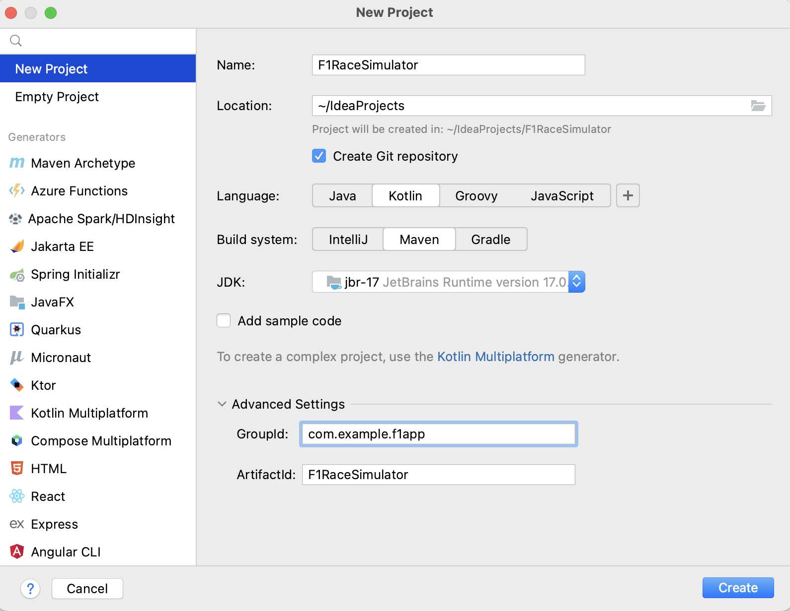
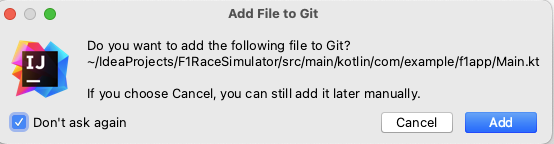
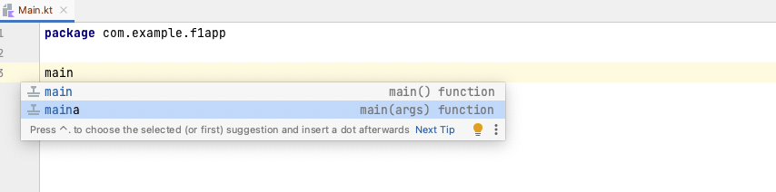
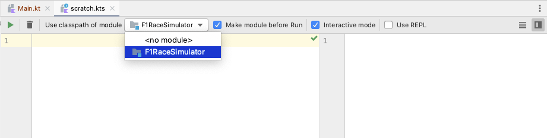

= 2. Prepare an F1 Simulator Kotlin Project
:sectanchors:

== 2.1 Create a new Kotlin Project
Create a new Kotlin project, Maven build system and Git version control.

1. Go to *File* > *New* > *Project* or click *New Project* on the welcome screen.
2. Select *New Project* on the left side menu.
3. Fill in project name as `F1RaceSimulator`.
4. Check *Create Git Repository* checkbox.
5. Choose *Kotlin* language.
6. Select *Maven* build system.
7. From *JDK* dropdown list select JDK 17. If you don't see this option in JDK dropdown list, then select Add JDK to add it from your computer.
8. Make sure *Add sample code* is unchecked
9. Expand *Advanced Settings* and update *GroupId* to `com.example.f1app`.
10. Click *Create* button.

Wait for the project to be created, it can take a few moments.

TIP: During the development process, if a popup appears, prompting you to add *Main.kt* to Git, you have the option to prevent this from happening automatically. Simply check the box labeled *Do not ask again*, and then press *Cancel*. This will ensure that new files are not added to your local Git repository without your explicit action.

== 2.2 Create a package with Main.kt

1. Go to *src/main/kotlin*
2. Right-click on the kotlin folder and select *New* > *Package*
3. Fill in `com.example.f1app` and press *Enter ⏎* key
4. Right-click on the new package, select *New* > *Kotlin Class/File* > type in `Main` in the text field and double clock on *File* drop down option.
5. in the new empty Main.kt type in `main` and select second option from drop down to create main function with arguments:

== 2.3 Create a Scratch file
* Right-click on `F1RaceSimulator` project in the *Project* pane, go to *New* > *Scratch file*
* Select *Kotlin*.
* Then select `F1RaceSimulator` from the module list.

* Finally check the *Make module before Run* checkbox.

* try printing Hello World by running :

[source,kotlin]
----
println("Hello World")
----

TIP: While working with Scratch files in IntelliJ, don't forget about the 'Scratch Output' tab, typically found on the bottom of your IntelliJ IDEA. If things seem to be going wrong or not working as expected, this tab displays any exceptions.

➡️ link:./3-variables.adoc[3. Variables]

⬅️ link:./1-prerequisites.adoc[1. Prerequisites]
