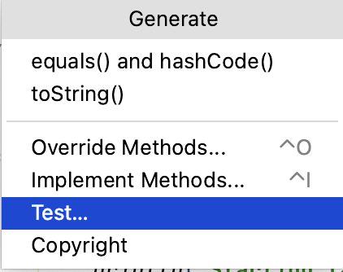
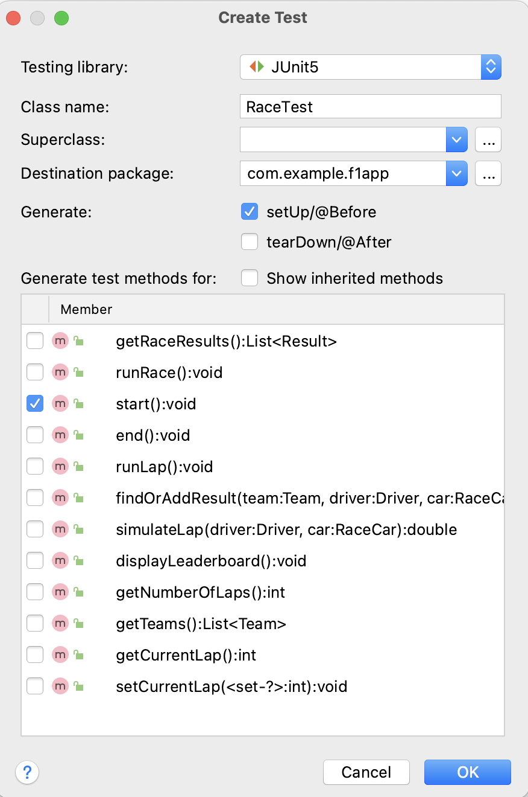
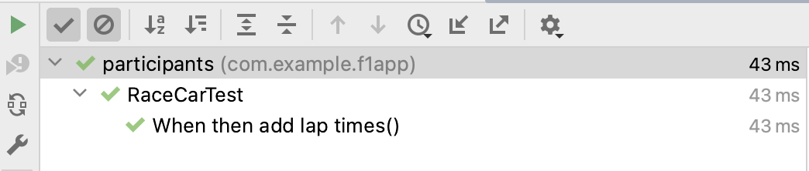
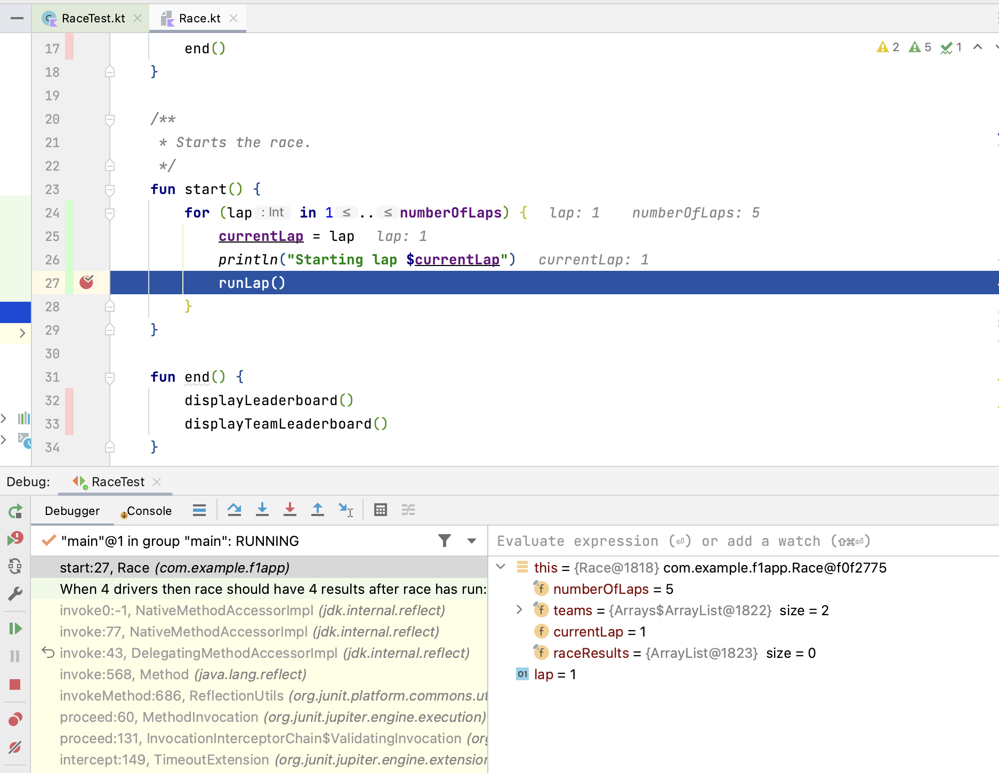
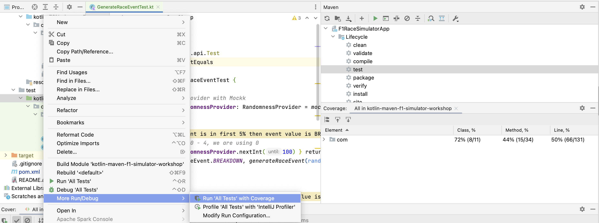
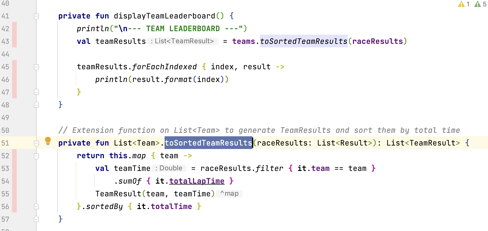

= 8. Function Testing and Introduction to Unit Tests
:sectanchors:

Testing helps us ensure that our code behaves as expected and allows us to catch bugs before they become a problem. We will focus on unit testing and function testing. Specifically, you'll learn how to use the JUnit framework in combination with the Kotlin testing library for unit testing our Kotlin code. Additionally, you'll learn how to mock dependencies with https://mockk.io/[MockK].

== 8.1 Add dependencies

Ensure `pom.xml` has the following dependencies:

TIP: Add your kotlin version to `properties` in your `pom.xml` so that it is not hardcoded in multiple places, e.g. `<kotlin.version>1.8.22</kotlin.version>`

IMPORTANT: `junit-jupiter` artefact is an aggregator artefact that also contains `junit-jupiter-engine`, if you have `junit-jupiter-engine` then it can be removed.

----
        <dependency>
            <groupId>org.jetbrains.kotlin</groupId>
            <artifactId>kotlin-test-junit5</artifactId>
            <version>${kotlin.version}</version>
            <scope>test</scope>
        </dependency>
        <dependency>
            <groupId>org.junit.jupiter</groupId>
            <artifactId>junit-jupiter</artifactId>
            <version>5.9.3</version>
            <scope>test</scope>
        </dependency>
----

IMPORTANT: Don't forget to reload maven changes!

== 8.2 Create a Unit Test
Create a Unit test for `Race.start()`. Here's how:

- Locate and open `Race.kt`.
- Inside the `Race` class, right-click and select *Generate... > Test ...*:

- Make sure to check the `setUp` and `start()` checkboxes:

This selection process prompts IntelliJ IDEA to generate a skeleton unit test for the `start()` function in the `RaceTest` class.

First lets add a constant that represents the number of laps we are going to use in the test. Place the following constant above the class definition:

[source,kotlin]
----
private const val NUMBER_OF_LAPS = 5
----

Then lets define a tested class instance `race` by adding a variable inside the test class definition:

[source,kotlin]
----
internal class RaceTest {
    private lateinit var race: Race
    // existing code...
}
----

TIP: Don't forget to import any required classes as you add them to the code. E.g. `Race` class.

Notice, we are using `lateinit` because we are going to initialize this variable in the setup method that runs before every test. This is to make sure we always have a fresh `race` for every test and tests do not have impact on each other.

We are now going to set up system under test (SUT) by building a race in `setUp` function. this function runs before every test:

[source,kotlin]
----
@BeforeEach
fun setUp() {
    val teamRedBull = Team(
        "Red Bull",
        listOf(
            Driver("Verstappen"),
            Driver("Perez")
        ),
        setOf(
            RaceCar(
                carNumber = 1,
                numLaps = NUMBER_OF_LAPS,
            ),
            RaceCar(
                carNumber = 11,
                numLaps = NUMBER_OF_LAPS,
            )
        )
    )
    val teamMercedes = Team(
        "Mercedes",
        listOf(
            Driver("Hamilton"),
            Driver("Russell")
        ),
        setOf(
            RaceCar(
                carNumber = 44,
                numLaps = NUMBER_OF_LAPS,
            ),
            RaceCar(
                carNumber = 63,
                numLaps = NUMBER_OF_LAPS,
            )
        )
    )
    race = Race(NUMBER_OF_LAPS, listOf(teamRedBull, teamMercedes))
}
----

Now let's implement a test. In Kotlin, you can use back tick quotes to make test descriptions more readable. Typically, this is done in a GWT (Given-When-Then) format. In our example let's shorten it to When-Then.

In the test , use the `assertEquals` from `kotlin.test` by importing it at the top of the class: `import kotlin.test.assertEquals`.

We are going to assert that the race has 4 results, one for each driver, and that current lap is 5 (last lap, that has finished).

[source,kotlin]
----
@Test
fun `When 4 drivers then race should have 4 results after race has run`() {
    race.start()
    assertEquals(4, race.raceResults.size, "Race should have 4 results, one for each driver")
    assertEquals(5, race.currentLap)
}
----

== 8.3 Test Execution

To execute the test, locate the green play button inside the test source file. Clicking this button runs the test. Alternatively, right-click the `RaceTest` file in the project view and select *Run RaceTest*.

Successful execution will produce an output similar to the provided image:

== 8.4 Debugging the Application

To debug your application while running the unit test, follow these steps:

1. Place a breakpoint inside the `for` loop in the `Race.start()` function.
2. Right-click on the `RaceTest` class in the project view and select *Debug RaceTest*.

During debugging, you can inspect the values of all the properties within our `Race` instance (see screenshot above). For instance, expanding the `teams` list reveals the teams participating in the race. Further expanding the object tree allows you to verify that each driver is correctly assigned a car in the `driverCarMap`.

== 8.5 Refactor & Regress
In this section, we will improve a function in `addLapTime` within `RaceCar` class. The aim is to refactor the function to make it more logical and intuitive, then we'll see how our unit test can catch a regression caused by this change. After the refactor, the test should fail because we've not updated other parts of the program accordingly. This illustrates the value of having a good suite of unit tests.

The following was our original `addLapTime` function:
[source,kotlin]
----
fun addLapTime(lapNumber: Int, time: Double) {
    lapTimes[lapNumber] = time
}
----

As you can see, the function adds a time and uses a lap number as array index. An index in an `Array` starts with 0, so our `lapNumber` parameter start with 0, which is not logical. The program works because we always pass in the previous lap number into this function, incrementing the lap number afterwards.

Let's improve this function, so we are going to accept the actual current lap number (so starting from 1). This means that we need to decrement lap number before we add result ot our `lapTimes` array:

[source,kotlin]
----
fun addLapTime(lapNumber: Int, time: Double) {
    lapTimes[lapNumber - 1] = time
}
----

As we have not changed the rest of the program, our test should fail now because the program no longer works properly. Run the `RaceTest` again and see whether it catches the bug.

You should see that the test has failed with `java.lang.ArrayIndexOutOfBoundsException`. This is because as part of our change we also need to make sure that the lap number is increased before we add `lapTime` to the array.

[#_8_6_identifying_bugs_and_debugging]
== 8.6 Identifying Bugs and Debugging

To identify and fix the bug, debug the program.A useful tip is to place a breakpoint where the `addLapTime` function is called.Focus on the sequence of when the `currentLap` is being incremented.Once you find and fix the bug, run the `RaceTest` again.The test should now pass, confirming that the bug has been fixed.

Now, add a unit test for the `RaceCar` class with the following scenario: `When a lap time is added, it should be in the correct position in the lapTimes array`.

The provided link leads to a commit showing the solution for the bug fix and this test case.

The solution can be seen in this commit: https://github.com/elenavanengelenmaslova/kotlin-maven-f1-simulator-workshop/commit/6ebf273a2da39bee776cdc0372ea1749f888c620

Next, let's add a test for a case where things go wrong, i.e., an unhappy path.Specifically, we want to test that the `addLapTime` function throws an `ArrayIndexOutOfBoundsException` when we try to add a result for a lap number that exceeds the limit which we set when we set up a race in the test `setUp`. For the test shown in the commit mentioned above, limit is 5 thus the test will look like this:

[source,kotlin]
----
@Test
fun `When lap number accedes 5 then throw ArrayIndexOutOfBoundsException`() {
    assertFailsWith<ArrayIndexOutOfBoundsException> {
        car.addLapTime(6, 3.6)
    }
}
----

== 8.7 Introduction to Mocking with MockK
Mocking is a technique in testing that allows us to isolate the unit under test by replacing its dependencies with mock objects. This section introduces you to the https://mockk.io/[MockK] library, which simplifies the process of creating mock objects in Kotlin.

Add MockK to `pom.xml`:

----
<dependency>
    <groupId>io.mockk</groupId>
    <artifactId>mockk-jvm</artifactId>
    <version>1.13.5</version>
    <scope>test</scope>
</dependency>
<dependency>
    <groupId>org.slf4j</groupId>
    <artifactId>slf4j-simple</artifactId>
    <version>2.0.7</version>
    <scope>test</scope>
</dependency>
----

We'll use MockK to test the `generateRaceEvent` function. However, first, we need to make the function more configurable to facilitate mocking. This involves creating a new class `RandomnessProvider`, refactoring the `generateRaceEvent` function to use this provider, and then writing unit tests that mock `RandomnessProvider`.

Create the following class in `Race.kt`:

[source,kotlin]
----
class RandomnessProvider {
    fun nextInt(until: Int): Int {
        return Random.nextInt(until)
    }
}
----

Update `generateRaceEvent` to make `RandomnessProvider` injectable though function parameters, and use it instead of `Random.nextInt` directly:

[source,kotlin]
----
fun generateRaceEvent(
    breakdownPercent: Int = 5,
    collisionPercent: Int = 2,
    randomnessProvider: RandomnessProvider = RandomnessProvider(),
): RaceEvent {
    val totalExceptionPercent = breakdownPercent + collisionPercent
    val event = randomnessProvider.nextInt(100).let {
        when {
            it < breakdownPercent -> RaceEvent.BREAKDOWN
            it < totalExceptionPercent -> RaceEvent.COLLISION
            else -> RaceEvent.NORMAL
        }
    }
    return event
}
----

Now we can add a unit test that mocks `RandomnessProvider` such that we can test all three conditions:

- Breakdown event
- Collision event
- Normal lap event

Right click in the source of `generateRaceEvent`, and change the test class name to `GenerateRaceEventTest`, then create this test.

Implement the following test with all three conditions covered:

[source,kotlin]
----
import io.mockk.every
import io.mockk.mockk
import org.junit.jupiter.api.Test
import kotlin.test.assertEquals

internal class GenerateRaceEventTest {

    //mock randomness provider with Mockk
    private val mockRandomnessProvider: RandomnessProvider = mockk()

    @Test
    fun `When random event is in first 5% then event value is BREAKDOWN`() {
        //any value  of 0 - 4, we are using 0
        every { mockRandomnessProvider.nextInt(100) } returns 0
        assertEquals(RaceEvent.BREAKDOWN, generateRaceEvent(randomnessProvider = mockRandomnessProvider))
    }

    @Test
    fun `When random event is in the next 2% then event value is COLLISION`() {
        // any value of 5 or 6, we are using 6
        every { mockRandomnessProvider.nextInt(100) } returns 6
        assertEquals(RaceEvent.COLLISION, generateRaceEvent(randomnessProvider = mockRandomnessProvider))
    }

    @Test
    fun `When random event is in the other 93% then event value is NORMAL`() {
        // any value of 7 - 99, we are using 99
        every { mockRandomnessProvider.nextInt(100) } returns 99
        assertEquals(RaceEvent.NORMAL, generateRaceEvent(randomnessProvider = mockRandomnessProvider))
    }
}
----

Run the test to see how it works.

Place a breakpoint in `generateRaceEvent` function and run the test in debug mode.

== 8.8 Test Coverage
Running tests with coverage helps identify which parts of the code are not yet covered by your tests.

- Right-click the *kotlin* folder inside the *src/test* folder.
- Select *More Run/Debug > Run 'All Tests' With Coverage*.

This will give a report showing which lines of code are not covered by your tests. You can use this information to add more tests and ensure your application's quality.

- If you get a popup asking about whether to add or replace coverage results, choose replace option.
- Expand coverage results in the right pane:

image::images/CoverageResults.png[coverage-results]

- We can see that `Race` class needs some more work. Double-click on that class in the coverage results pane to see which lines need covering (green marks covered lines, and red marks uncovered lines).

== 8.9 Add tests
Let's improve test coverage a little. It is important not only to just cover the code lines but also to do asserts on the results to ensure correct behavior of the code. You do not need to test any code that is generated, e.g. `equals`, `hashcode` and `toString`.

TIP: Remember to use new test for each scenario (GWT - Given-When-Then)

Your task is to add a test for `Driver.addPoints` function.

Solution example can be found here:

https://github.com/elenavanengelenmaslova/kotlin-maven-f1-simulator-workshop/commit/e84ce4277f506a4947e93001501e3bc98536fd19#diff-97eed5a79857688b910919ec09d94a5f07cef6af09af608ed909a907461e61a1

➡️ link:./9-null-safety.adoc[9. Null Safety]

⬅️ link:./7-functions.adoc[7. Functions]
